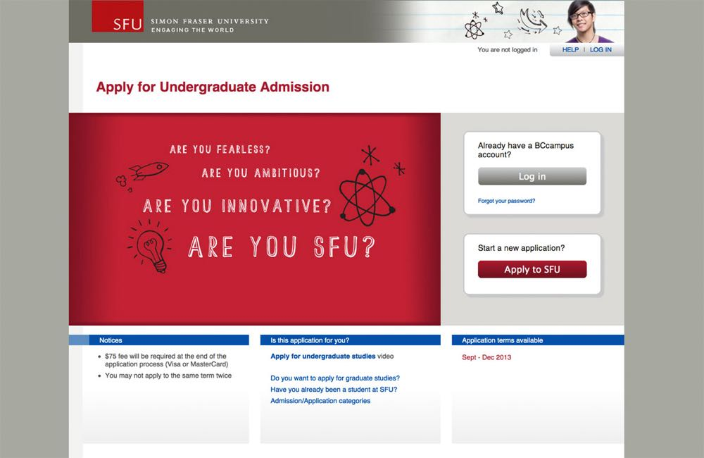
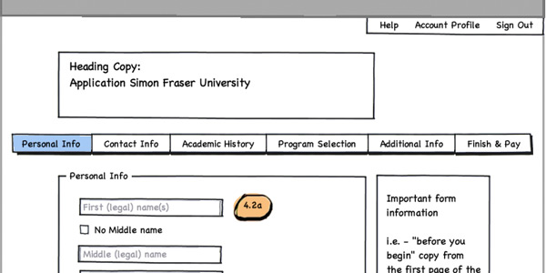
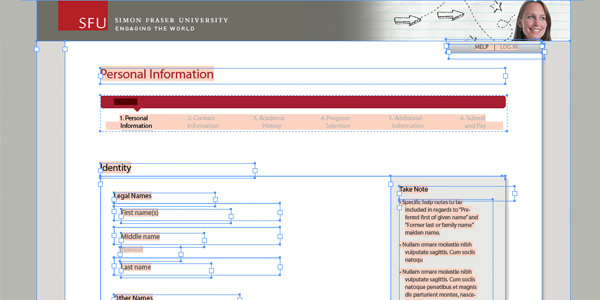
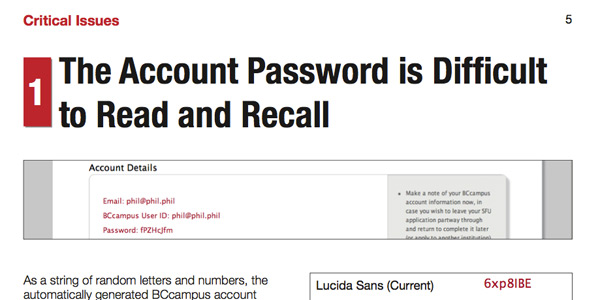
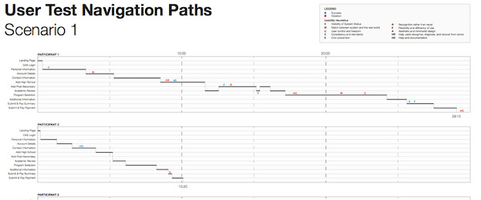

    

        
        
<a href="applybc_sfu_user_study_report.pdf">Read the ApplyBC SFU user test report</a> (pdf)

    

    

        

            <h3>Overview</h3>
            
During my co-op internship at BCcampus, I worked on a project to upgrade ApplyBC, an online application service for most universities and colleges in British Columbia. This upgrade was just for Simon Fraser University, with other institutions following suit. The upgraded site improved usability and accessibility, as well as styling each application form in the institution’s branding.

        

        

    

    
    

        

            <h3>Joining mid-stream</h3>
            
When I joined BCcampus, they were well underway creating wireframes in Balsamiq. I familiarized myself with the project, and then worked on fleshing out details in the wireframes. Since the page layout was mostly done, I was tasked with making wireframes for interactions such as pop-up boxes and menus. The trouble I ran into was that every day we discovered a new interaction that hadn’t been accounted for or had been overlooked. I would say the wireframes were done, then be hit with another surprise requiring I go back and update them again.

            
My solution was to create a click-through version of the wireframes. This allowed me to do some simple user testing with my co-workers, which resulted in a list of all the interactions I discovered during the testing. Thanks to participants asking “what happens if I click here?” I could find many more interactions than by chance alone. Later on, the click-through wireframes were used to demonstrate the design to SFU's project management office. The SFU staff were able to try out the click-through wireframes themselves, explaining how the site would work far better than I could in a demonstration.

        

        

    

    
    

        

            
        

        

            
One of the Balsamiq wireframes used to design ApplyBC.
 
        

        

    

    
    

        

            <h3>Development by pixels</h3>
            
With the wireframes complete and SFU satisfied with our plans, I shifted to working on implementing the front-end of the SFU application. To ensure that the application matched SFU’s branding, ApplyBC’s designer created a high fidelity wireframe using Adobe InDesign. Seeing as I was experienced with InDesign, I acted as a go-between communicating the design to other developers on the team. I was responsible for much of the HTML and CSS, working with the designer and developers to create a pixel-perfect implementation of the design from the InDesign wireframes. As well, I was involved in researching possible JavaScript frameworks to use, although time did not permit using them.

            
Once the front-end was completed, I was put on testing and documenting the application. Most of the UI widgets were handled by GWT, which I was charged with reviewing the code and adding comments where necessary. I also assisted with some automated testing using Selenium. To make sure all the widgets were functioning correctly, BCcampus ran internal tests where some of my co-workers would follow a test script through the application. I was responsible for writing the test script, using my knowledge of the widgets and how they worked, as well as writing a summary of their findings for the development team.

            
My strategy for these tests was to assign each of the co-workers involved a persona. I had written foundation documents for three personas, each representing the types of users who might apply to university on ApplyBC. There was a local high school student applying for the first time, an international student, and a student transferring from another institution. I gave the personas backgrounds, stories, and tried to make them seem like real people. Then I instructed my co-workers to take on the role of these personas, essentially treating the test like a scenario so that they might behave and empathize more with the users. This was only a partial success, as these co-workers weren’t familiar with personas, and I suspect my laboured explanations weren’t enough to persuade them to act in character.

        

        

    

    
    

        

            
        

        

            
As an intermediate step, high-fidelity wireframes were created in Adobe InDesign.
 
        

        

    

    
    

        

            <h3>Accessibility</h3>
            
BCcampus anticipated that eventually the government of British Columbia would enforce an accessibility standard on all education-related websites, as Ontario had already put such a law in place. I was made responsible for determining what level we could achieve with the ApplyBC upgrade, given that development was by that point well underway. At that time, I knew little about accessibility beyond semantic HTML usage. I first put together a report on what level we could achieve, and the success criteria that were relevant to ApplyBC.

            
In my report, I suggested that we could achieve level A conformance relatively easily, so I was put in charge of implementing it. I made changes to the HTML in ApplyBC that would meet the WCAG success criteria at level A or higher when possible. Then I tested it, using virtually every screen reader that I could get my hands on. With a tip from a co-worker, I was able to also have a disabled student test the site, who successfully navigated it with their keyboard and screen reader.

        

        

    

    
    

        

            <h3>Testing</h3>
            
The final stage of the upgrade plan was to run formal user tests on representative users. A fellow intern took care of recruiting high school and transfer students planning to apply to university. My role was to research and write the user test plan. This being the first of many user tests on the new ApplyBC applications, I felt it was important to set a baseline for future tests. Previous user tests conducted at BCcampus only left us with few artifacts. I wanted to leave the next people with a complete record of what we did and why. I was given plentiful time to prepare, which I used to write a detailed test plan and research the think-aloud method thoroughly. My goal was to design a test that was rigorous, repeatable, and produced useful results.

            
The focus of the paper was whether or not using the “think-aloud” method was valid. In the years since Jakob Nielsen’s seminal book that spread the method, Usability Engineering, mounting criticism argued that he had gone too far in simplifying it. Without clear directions to keep the test participants on task and a strict separation between users and researchers, there would be a serious temptation to influence the user. If the researchers are influencing the participants, then they’re not really learning anything from the test.
 
            
However, performing a strict user test would be difficult for us as researchers because it would be hard to account for every possible situation, and we can’t maintain that level of discipline. Worse, creating a highly sterile test environment could make participants uncomfortable and behave abnormally. I tried to address the criticisms, and offered specific suggestions on how the ApplyBC user test would take the best of the think-aloud method without getting too bogged down in strict approaches. For example, I borrowed a list of vague hints we could give participants when they’re stuck, with instructions on how to escalate if the participant is having major difficulty with a task.
 
            
The rest of the paper served as a reference to describe the test structure, and the tools we would use. The plan for the test was to start with a short questionnaire, have the participant use the application to apply to a university, then finish with an interview. There would be two researchers in the room with the participant. One would give instructions, while the other observed and wrote down questions for the interview. As well, we recorded the application on video, which we could turn back to as a reference. Each of these methods were intended to to capture a different aspect of the test to complement each other: what the participant did on the spot, their reflections, and unintentional actions.

        

        

    

    
    

        

            
        

        

            
First page of the ApplyBC SFU user study report, describing why the random password generator causes problems for users.
 
        

        

    

    
    

        

            <h3>Outcome</h3>
            
The user test went remarkably smoothly. I had deliberately scheduled more participants than we needed, so when a few cancelled we had exactly the number of recruits we needed. And as expected, the user tests produced a few surprises. It was hard enough to avoid helping the participants with the mild test design I had created. The video recordings of users were incredibly helpful both for us and showing issues to the development team. Probably the only disappointment was that the snacks and drinks I had lobbied for turned out to be unpopular. Turns out high school students aren’t so keen on cookies.

            
Our findings were summarized in a report describing exactly where usability problems were found and their severity. I was responsible for designing and editing the report with Adobe InDesign, in addition to writing much of it. The report was structured to identify key issues we discovered during the user test, and offer specific suggestions for fixing them. I had to balance the report’s design between being useful for the various stakeholders in ApplyBC (SFU, BCcampus directors) and the development team in BCcampus. My approach was to make the report as specific as possible, as opposed to high-level summaries, so that each group would know exactly what they had to in the next update of ApplyBC. I also included a chart of the user test, showing at exactly what points participants had issues so that others could investigate them.

            
Submitting the report was my last work at BCcampus, and judging by the changes since, it seems like the report was taken to heart.
 
        

        

    

    
    

        

            
        

        

            
A chart I created as an appendix to the user test report to show where test participants navigated during the test, and how long they took.
 
        

        

    

    
    

        
Tools used:

        <ul>
            <li>HTML/CSS</li>
            <li>JavaScript</li>
            <li>GWT (Java)</li>
            <li>Eclipse</li>
            <li>Balsamiq Mockups</li>
            <li>Selenium</li>
            <li>Adobe InDesign</li>
        </ul>
        
Skills applied:

        <ul>
            <li>Web Development</li>
            <li>User testing</li>
            <li>UX Design</li>
            <li>Information Design</li>
            <li>Accessibility</li>
        </ul>
    

