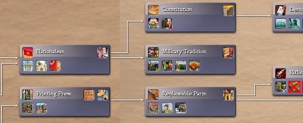
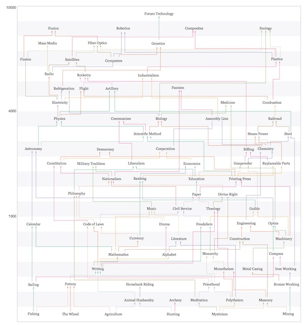
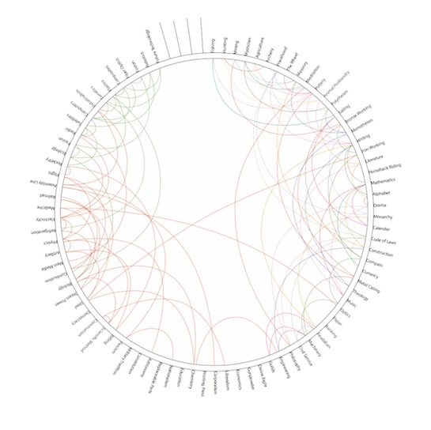

    <h3 id="civ">Civilization 4 Technology Poster</h3>
    
    

        
Technologies used:

        <ul>
            <li>Adobe Illustrator</li>
        </ul>
    

    

        

            
This started off innocuously, as a Christmas present for my father. He's a long-time fan of Civilization 4, and I thought it would be nice for him to have a copy on his wall, made more legible and more clearly labeled than the the one that came in the box.

        

        

    

    

        

            
        

        

            
The original technology tree appears to be a linear path from left to right. However, the arrows have different meanings. One arrow is a mandatory path, two are different options. Some paths aren't even shown as lines, instead they are indicated by icons in the upper right of each box.
 
        

        

    

    

        

            
However, once I started trying to understand the workings of the technology tree, I realized this was actually one of the most complex tree structures I had ever encountered. It’s a non-linear tree with many overlapping paths, more like a maze than a tree. The original designer’s approach was to hide this, making the chart look much simpler than it actually was. My first attempt at a design was to reveal the hidden paths and organize them.

        

        

    

    

        

            
        

        

            
A first try at redesigning the tree, showing all of the paths that were hidden and identifying optional paths by colour. A major improvement in consistency, but much more of a maze.
 
        

        

    

    

        

            
The biggest issue I identified with this first draft was that the paths were often extremely long, which made it very likely that they would overlap. I tried shifting the positions of the technologies around, with little luck doing better. Some brief experiments with algorithms to optimize the nodes suggested there wasn’t much to gain. So instead, I tried wrapping the nodes around in a circle.

        

        

    

    

        

            
        

        

            
I’ve gone from a maze to a hairball. Not much progress, it seemed.
 
        

        

    

    

        

            
Finally, it hit on me to try merging the circle and tree concepts into one: this allowed for me to create a visually clear arrangement for the paths with a minimum amount of space. It also made for a good visual metaphor, showing the progress of technology in game as spokes in a wheel.

        

        

    

