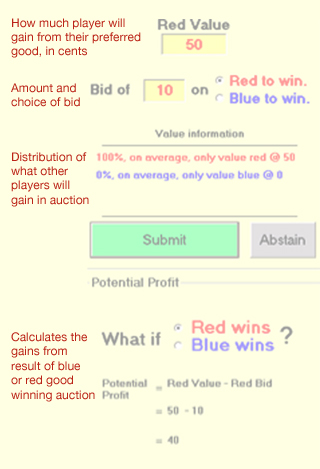

<a href="E428pcclarke.pdf">Download this paper</a>

    

        

            
Imagine a city trying to build a bridge that would require the destruction of many peoples' homes. Today, this could lead to a major political conflict, as commuters and the people losing their homes argue in the public square. Is a win-win situation possible in this scenario? The experiment I performed was a bidding game, to test the waters of what many would consider an unfathomable solution: paying for votes.

            
Vernon Smith looked to a different source for inspiration when he created his compensation mechanism.  Knut Wicksell (1896), a Swedish economist, had proposed that all changes in public spending must require some form of unanimity to be just, calling it the “Principle of Unanimity and Voluntary Consent in Social Choice.”  Smith (1977) created his auction election mechanism in the hopes of fulfilling the criteria of Wicksell’s principle.  In Smith’s auction election, players could bid for the public goods they want, or request compensation if they believe they are being hurt.  The game only proceeds if all players agree.

        

        

    

    

        

            
Thus "bids" stood in for "votes". In the compensation election there are two results to the bridge scenario: the majority wins and their winning bids are used to pay off those who would lose their houses, or the minority wins and their winning bids are spread amongst the majority. Either way, all parties leave the compensation election with something gained - something that doesn't often occur in an election.

            
We were largely successful in reproducing Oprea et. al’s results with our final 10 rounds.  Players learned to “shade” their values, bidding around half of their value.  As noted in their paper, this is not especially desirable for providing public goods.  In our experiment, when players shaded their bids, the presence of just a few players with unusual strategies can cause random results.  If shading decreases in larger groups, as Oprea et. al found, then this is not such a great concern.  But in real world situations, with real money, we wonder if a few wealthy individuals could cause random behaviour in the compensation election.

            
Prior research into the compensation election mechanism had placed participants into two even groups, suspiciously coloured red and blue. My experiment tested whether being in a minority with strong preferences affected the behaviour of participants. Due to the limitations of the experiment, my only significant result was to confirm prior research. However, the experience I gained in designing, researching, and conducting human participant experiments, would prove to be useful in later user studies.

        

        

            
Wicksell is credited with the insight that, in principle, if a proposal yields an outcome that is common to all members of a collective, and that outcome provides a preferred social state for the members of the collective, then there exists a compensation scheme whereby those who gain from the outcome can compensate those who lose and the outcome can command unanimous consent.

            
&#151;Oprea et al. (2005)

        

        

    

    

        

            
        

        

            
The compensation election interface as seen by participants in the experiment.

        

    

