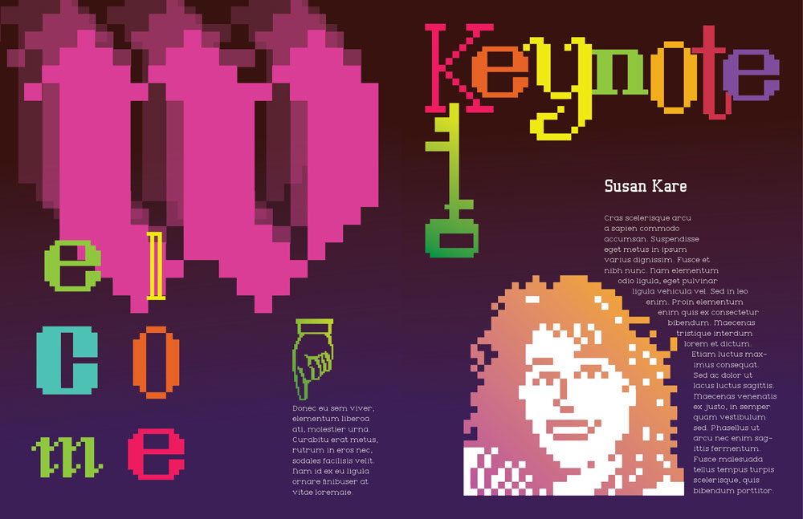
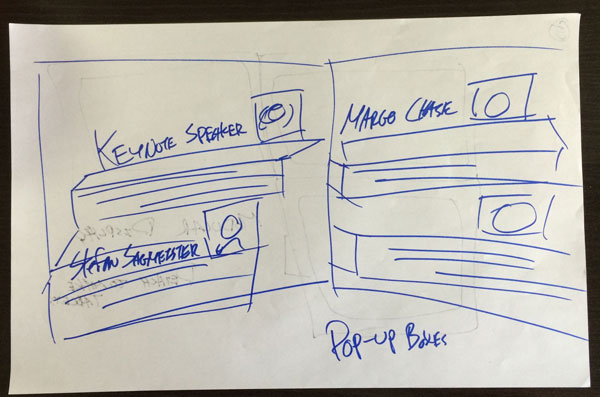
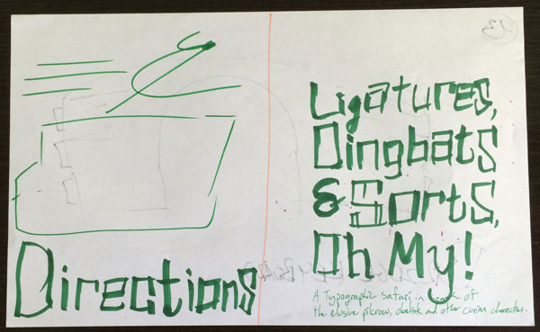
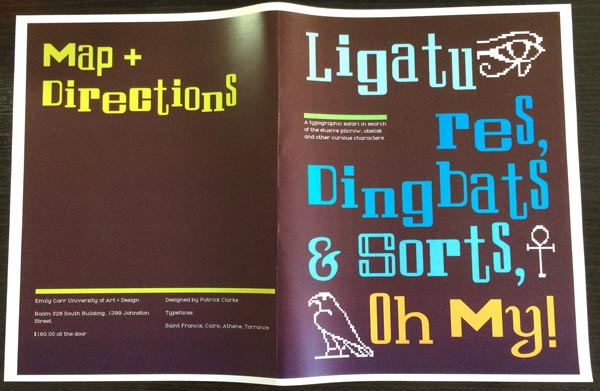

    

        <picture>
          <source media="(max-width: 799px)" srcset="dingbats-p2-1000w.jpg">
          <source media="(min-width: 800px)" srcset="dingbats-p2-2000w.jpg">
          
        </picture>
    

    

        

            <h3>Overview</h3>
            
An individual course project to design a pamphlet for an imaginary typography conference on dingbats. Used the original Mac typefaces "San Francisco", "Cairo", along with an updated version of "Toronto", "Torrance", to evoke a retro design.

            <h4>Role</h4>
            <ul>
                <li>Visual design</li>
            </ul>
            <h4>Technologies Used</h4>
            <ul>
                <li>Adobe Illustrator</li>
                <li>Adobe InDesign</li>
            </ul>
            
<a href="dingbats.pdf">Read the Dingbats Conference Pamphlet</a> (pdf)

        

    

    

        

            
In spring 2016, I took a course in typography at Emily Carr University of Art + Design. Aside from a general design interest, I realized that typefaces (or fonts, if you must) are especially important for the web. As vector objects they scale well, which is a useful feature when creating responsive websites.

        

        

    

    

        

            <picture>
              <source media="(max-width: 799px)" srcset="dingbats-sketch-1-600w.jpg">
              <source media="(min-width: 800px)" srcset="dingbats-sketch-1-1200w.jpg">
              
            </picture>
        

        

            
An early sketch experimenting with the layout.

        

        

    

    

        

            
The goal of this pamphlet was to showcase a particular designer's dingbat typeface in a creative layout. As a Mac user, I had a soft spot for the old "city name" Mac typefaces by Susan Kare that came with early versions of the Mac operating system. I was able to find an updated version of "Toronto" called "Torrance", but for "San Francisco" and "Cairo" I vectorized individual characters.

        

        

    

    

        

            <picture>
              <source media="(max-width: 799px)" srcset="dingbats-sketch-2-600w.jpg">
              <source media="(min-width: 800px)" srcset="dingbats-sketch-2-1200w.jpg">
              
            </picture>
        

        

            
A later sketch, where I'm honing in on the text positioning.

        

        

    

    

        

            
Starting from rough sketches, I was able to fairly quickly come up with a design for the pamphlet's layout. The challenge ended up being in the colours; I wanted to contrast the old-school fonts with flat design inspired gradients. Translating CMYK to print produced more than a few surprises, requiring me to print off dozens of test prints to find out if the printers at Emily Carr could actually print what I wanted.

        

        

    

    

        

            <picture>
              <source media="(max-width: 799px)" srcset="dingbats-test-600w.jpg">
              <source media="(min-width: 800px)" srcset="dingbats-test-1200w.jpg">
              
            </picture>
        

        

            
A test print to make sure the colours I've picked look good and are displaying correctly.

        

        

    

    

        

            
The test prints were more helpful than I expected, because not only was I able to check if the colours were printing correctly but also I could check if they looked good! Iterating my pamphlet through repeated prints gave me much more useful information than looking at the file on my monitor. This resulted in one of the most colourful designs I've ever made, and one I'm quite proud of.

        

        

    

