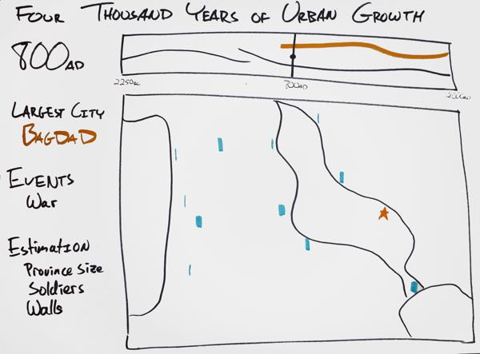
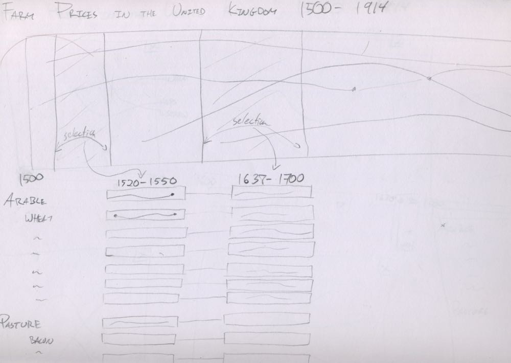
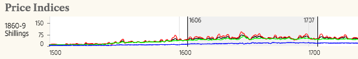
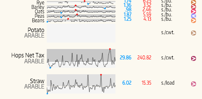
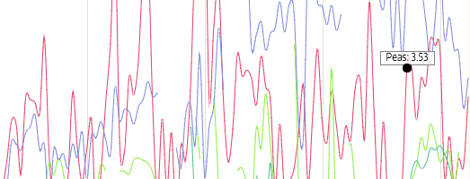

    <h3 id="engfarm">English Farm Prices History</h3>
    

        
        
<a href="demo/index.html">View the Interactive Data Visualization</a>

    

    

        
Technologies used:

        <ul>
            <li>Processing (Java)</li>
            <li>Microsoft Excel</li>
        </ul>
    

    

        

            
For my final project in my introductory visual analytics course, the assignment was to create an interactive data visualization of my choice. Of course, the challenge when you can do just about anything is settling on a topic. Being a history buff I first tried to visualize the data set of long-term city demographics in Tertius Chandler’s book Four Thousand Years of Urban Growth. My first sketches were promising, but I was soon taught a hard lesson in acquiring data: transcribing data sets by hand is time consuming.
         
        

        

    

    

        

            
        

        

            
Visualizing major events and populations of ancient cities.
 
        

        

    

    

        

            
Sticking to my history theme, I chose to visualize a data set from another book, Gregory Clark's A Farewell to Alms on the prices of English farm goods. Thankfully, Clark posted his data on his website in convenient CSV form. This made getting a few early prototypes working quite easy, which inspired more sketches. But while I thought the data set was interesting, there wasn't any particular story that I wanted to tell with the data. I went through many sketches trying to figure out just what kind of visualization to make.
         
        

        

    

    

        

            
        

        

            
A rough sketch of farm prices, thinking about drilling down using multiple selections.
 
        

        

    

    

        

            
I realized that exploring the data was in fact the most interesting part of this data set because there are many stories being told with it – the Napoleonic wars, the Irish potato famine, and many others in this time period. My final design focused on drilling down from the long span of 400 years into a manageable number of years for comparison. Each step along the way uses a slightly different type of time plot so that users can compare and view farm goods. The most notable are the bandlines, a concept borrowed from <a href="https://www.perceptualedge.com/articles/visual_business_intelligence/introducing_bandlines.pdf">Stephen Few</a>, which makes it easier to spot high and low points in the history of the price.
         
        

        

    

    

        

            
        

        

            
First, select the time frame.
 
        

        

    

    

        

            
        

        

            
Then select the farm goods to view. Note the fisheye effect on mouseover.
 
        

        

    

    

        

            
        

        

            
Now you can explore the data in detail.
 
        

        

    

    

