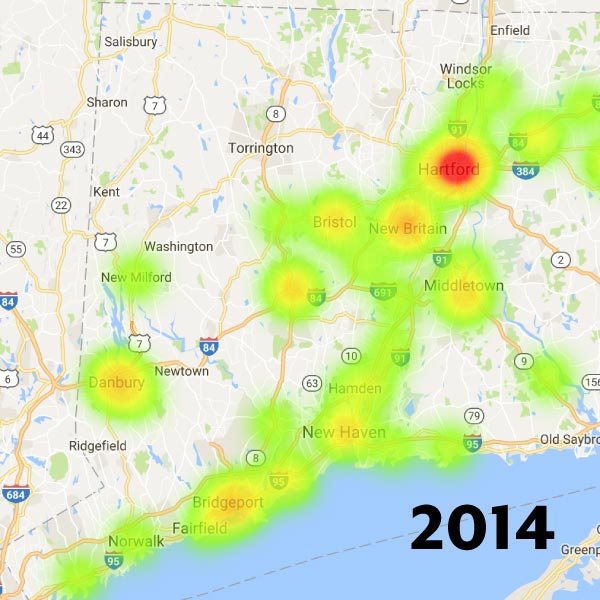

    

        
    

    

        

        	

	            <h3>Overview</h3>
	            
A team project where I contributed an animated map to visualize the scale and speed of overdoses in Connecticut. The team’s goal was to demonstrate how analytics and visualizations could help healthcare users explore overdose data in British Columbia, if such data were available. Eventually, data from Fraser Health did emerge and I made maps of opiate overdoses using it.

	            <h4>Role</h4>
	            <ul>
	            	<li>Data research and analysis</li>
	            	<li>Data visualization design</li>
	            	<li>Front-end development</li>
	        	</ul>
	            <h4>Technologies Used</h4>
	            <ul>
	            	<li>Tableau</li>
	            	<li>JavaScript (D3.js)</li>
	        	</ul>
	        	
<a href="https://sophiahe.github.io/FHH/">View Connecticut overdose animation</a>

	        	
<a href="http://3pats.ca/2017/01/30/overdose.html">View map of overdoses in the Fraser Valley by city</a>

	        	
<a href="http://3pats.ca/2017/02/21/hospitals.html">View map of overdoses in the Fraser Valley by hospital</a>

        	

            <h3>Hacking for Health</h3>
            
In January 2017, I attended the two-day <a href="https://www.healthhackathon.ca">Health Hackathon</a> organized by Fraser Health at the Surrey SFU campus. Although I was an employee of Fraser Health at the time, I attended as a participant by myself. I offered myself out as a designer for hire, and wound up working with a team of six data science students at SFU. Having mostly worked either by myself or with developers up until then, I was excited to work with people who knew much more about data than I did. The challenge they selected was related to the opiate/fentanyl crisis:

            
Overdose Analytics: Fraser Health Authority is facing the challenge of targeting their resources in the midst of unpredictable but growing waves of overdoses. Information on overdoses is distributed through siloed channels making it difficult to produce actionable intelligence on overdoses in the region. Such information is useful to medical professionals, social services and other government bodies.

			
Your challenge will be to produce an application that aggregates information from the media, medical, law enforcement and public sources to produce a database and visual map of overdoses that includes both real-time alert functionality along with historical data-mining of overdoses. Such a tool should be able to show where a sudden surge of overdoses is occurring, creating an early-warning indicator of a batch of bad drugs in a certain area or from a certain source, as well as analytical tools that indicate where overdoses tend to happen at given times of day, days of week and/or locations.

			
The team’s plan was to create an analytics tool using modelling techniques they had learned in class. The data scientists had attended other hackathons in the past, and were very confident that they could build a model that would estimate where overdoses would occur. However, they had overlooked that part about “an application that aggregates information…” In the past hackathons they had attended, the data scientists were provided with some data. This time there was no data provided. We were expected to scrape data from online sources.

			<h3>Data visualization minus data</h3>
			
Without data or analytics, my role in the team became less clear. No longer could I sketch designs, expecting some future analytics to come along. I joined in with the rest of the data scientists trying to find news articles about overdoses, social media posts, and anything else that could potentially be scraped for data. For example, we hoped that we could gather demographic data from social media posts made by overdose victims, and then use that to make predictions about what groups were more likely to overdose. But there wasn’t enough of them and without an easy way of scraping data, the research was time consuming. For a two-day hackathon, we didn’t have enough time to gather data, let alone create analytics and design an interface.

		

	

	

		

			
		

		

			
Exploring correlations between high schools and overdoses.

		

	

	

		

			
Instead, we looked for available data on opiates from other jurisdictions. The health authorities in British Columbia don’t publish much data on overdoses, but many places do. One of my teammates discovered that Connecticut had extensive data on overdoses, including the location of the overdose, the date, and what type of drug caused it. We quickly got to exploring the data using Tableau, and creating some dashboards with it. The data scientists thought that if they could create some models using this data, then it could be extended to British Columbia.

		

	

	

		

			
			
			
			
			
		

	

	

		

			<h3>Storm over Connecticut</h3>
			
My role ended up being to create a map for the data, suggesting what could be done for British Columbia. In the little time I had, I tossed around a few dashboard ideas. However, it seemed we had enough of that in Tableau. What we needed was data storytelling, providing a narrative to survey the data. Feeling inspired by a famous map of deaths in Iraq, I created an animated bubble map of the overdoses in Connecticut, combining a map and a bar chart to show the accelerating pattern of overdoses. The rest of the team worked on slides and Tableau charts to describe what analytics our theoretical system would have if built.

		

	

	

		

			
		

		

			
The Connecticut animation of overdoses.

		

		

	

	

		

			
While my team didn’t win any of the prizes at the hackathon, we did manage to get an offer to work with Fraser Health on developing the analytics further — through the SFU student co-op program. As I was no longer a student, the offer didn't do me much good, but it was nice to see that our efforts were recognized by Fraser Health.

			<h3>Postscript: real data</h3>
			
Strangely, Fraser Health released their opiate overdose data on the second day of the hackathon, right before we presented our projects. This didn’t help my team, but it gave me the opportunity to make more maps with this new data. I created a chorlopleth map of the city data, plus one using pie charts for the emergency ward data and posted them on my blog 3Pats.

        

        

    

	

		

			
		

		

			
Opiate overdoses in the Fraser Valley by city.

		

		

	

	

		

			
		

		

			
Opiate overdoses in the Fraser Valley by hospital, and homeless share.

		

		

	

