

    

        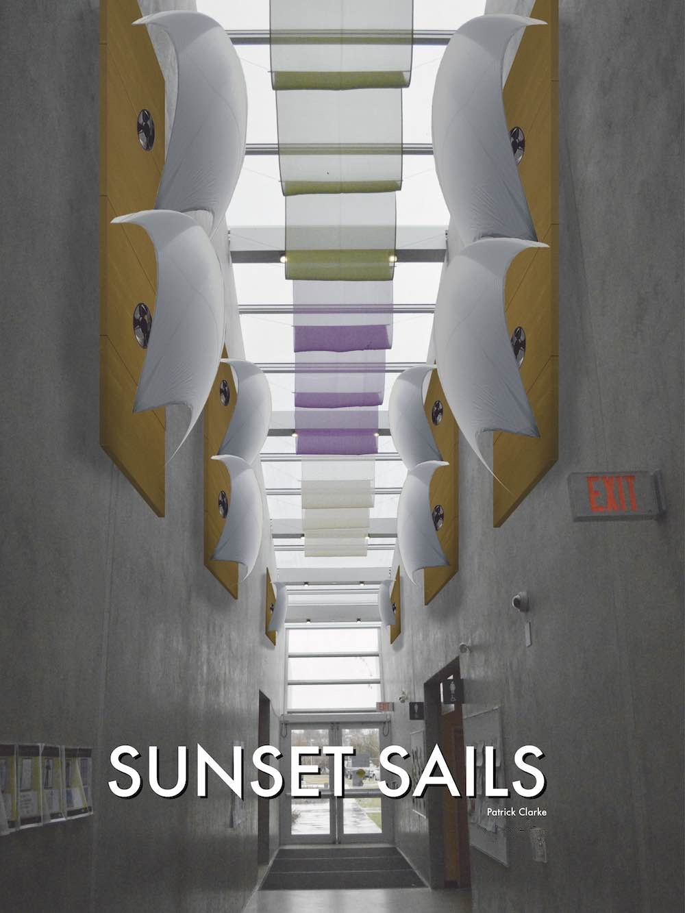
    

    
    

        

            <h3>Overview</h3>
            
Sunset Sails is a design for data visualization installations around the <a href="http://vancouver.ca/parks-recreation-culture/sunset-community-centre.aspx">Sunset Community Centre</a> in Vancouver, BC. They show how much natural gas the building is using by how much air is being blown through the sails. Visitors in the building can look at the sails to learn about how energy efficient the building is, and can get a real sense of when they should use less energy.

        

        

    

    
    

        

            <h3>The project brief</h3>
            
This project was for a course in speculative design, where design thinking was applied to solve real problems faced by the City of Vancouver.  Of the three projects offered by the city, my team chose to work on displaying energy consumption for city buildings. The engineers felt that their hard work to bring the city’s buildings up to LEED green standards had gone unnoticed by residents. They hoped that with this project we could bring attention to it, and communicate the benefits of the buildings to visitors.

            
Being a speculative design course, we were encouraged to start of with as many wild and zany ideas as possible. We were even discouraged to think about how practical our designs were. This is one of my favourite parts of a project, when just about anything seems possible. Each week in this course there would be a critique or presentation, the first being to select from these initial sketches.

        

        

    

            
    

        

            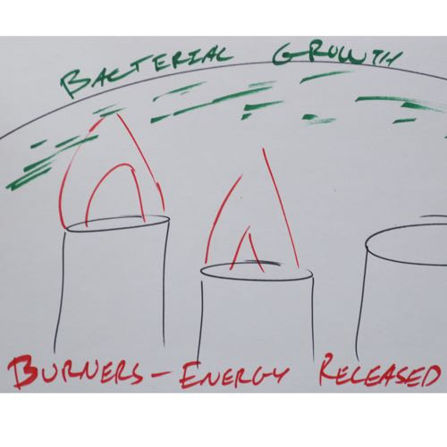
            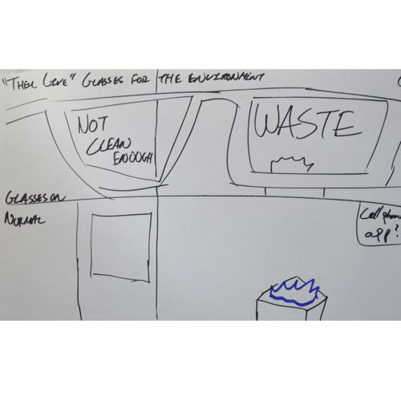
            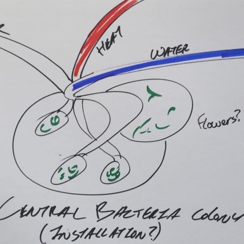
            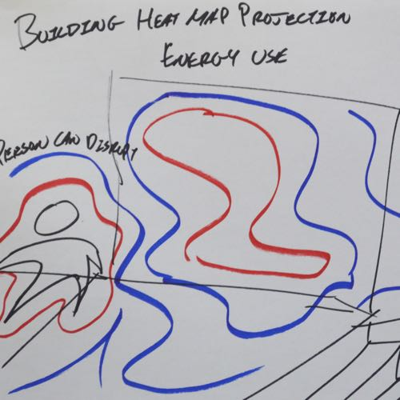
            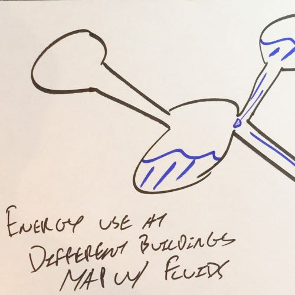
            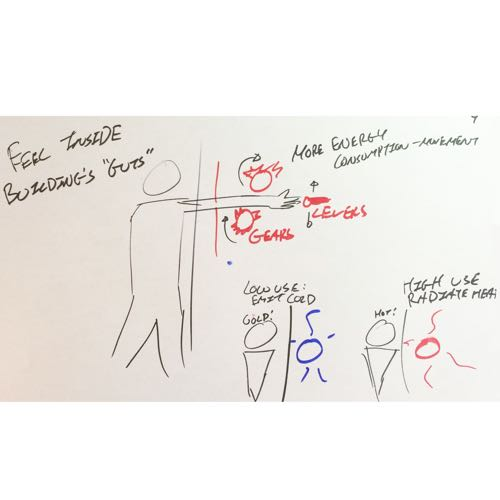
            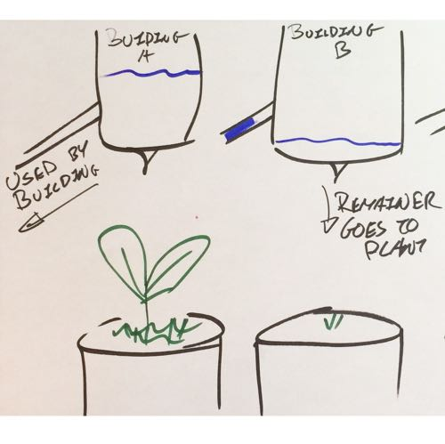
            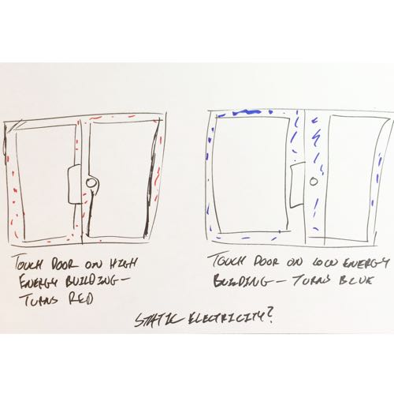
            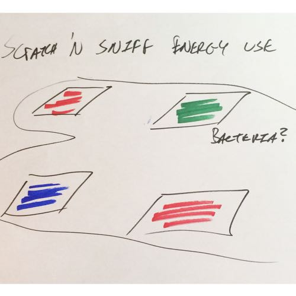
            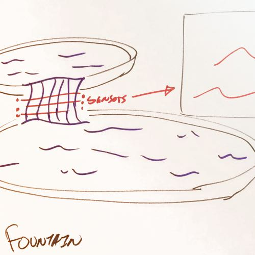
            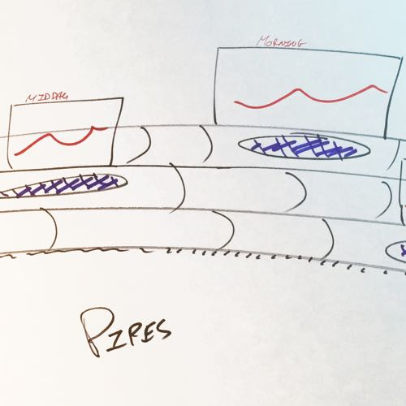
            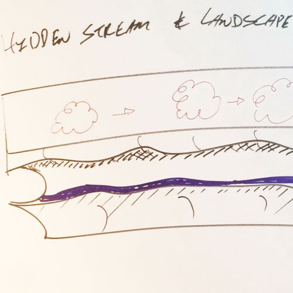
        

    

            
    

        

            
The city engineers were considering putting up a screen with data visualizations in city hall to display the buildings’ energy use. With my sketches, I was exploring what was the design space for visualizing data, what could be a data visualization, and if we needed to visualize data at all. I drew mostly physical objects because I thought that there was a huge opportunity to use the space in the buildings, adding or changing them to show energy use.

        

        

    

    
    

        

            <h3>Refining the rough designs</h3>
            
Out of the many sketches and I my teammates made, we narrowed it down to two designs. My “winning” idea was based on Edward Tufte’s wavefield concept, except instead of video I would try to actually build it. A flowing panel of water represented water consumption by speed and acted as a surface for a projected data visualization. The key idea to the design was that data could be represented by materials, either literally (with water) or abstractly (light for natural gas) so that people could actually touch the data. I felt that touching the data would give it much more impact than a chart on a screen.

        

        

    

            
    

        

            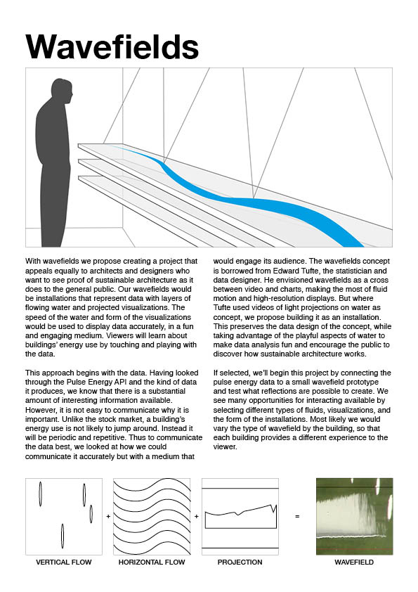
        

        

            
A handout sheet I made for the wavefields, giving an overview of the concept.
 
        

        

    

    
    

        
        
            
My teammate’s idea was to create cloud-shaped pillows, whose colours would display energy use of the building they were in. When people hugged them, they would show more detail about the building’s energy use.

        

        

    

    

        

            
        

        

            
An early concept showing energy use as a friendly "pillow" to be placed around city buildings. Hygene concerns ruled this idea out.
 
        

        

    

    
    

        

            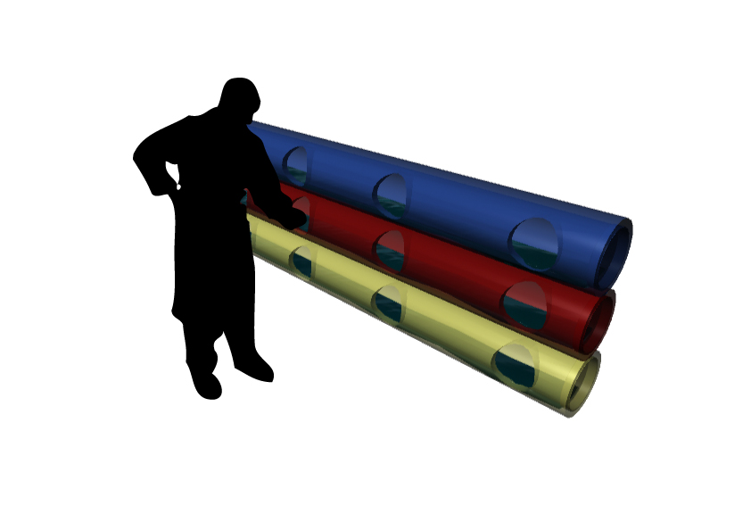
        

        

            
We also toyed with the idea of putting the wavefields in pipes, and focusing on just the water interaction.
 
        

        

    

    

        

            
We then had a couple of weeks for refining and realizing the designs. I took photos of the buildings where our designs would be situated, so that our presentations could better show how they would actually look. Most of the work was determining specifics so that we could present them in class with more detail than a rough sketch. With the wavefield design, we struggled to figure out where it would be located, settling on attaching it to a wall so that there would be room for projectors and display panels. A rectangular shape was chosen so that there would be a clear start and ending point for the water flow.
 
            
I also investigated the technical side of the energy consumption project. The city had connected their newest buildings to a web API that provided consumption data. Depending on the building, you could get electricity, water, or natural gas usage. I worked with city officials to learn about how these systems worked to understand and inspire how I could refine my designs further. Once I realized that it was possible to have live data updates, I explored whether it would be possible to have interaction with the wavefield. Water-based gestures or perhaps a touchscreen underneath the water sounded like a cool idea in theory.

        

        

    

    
    

        

            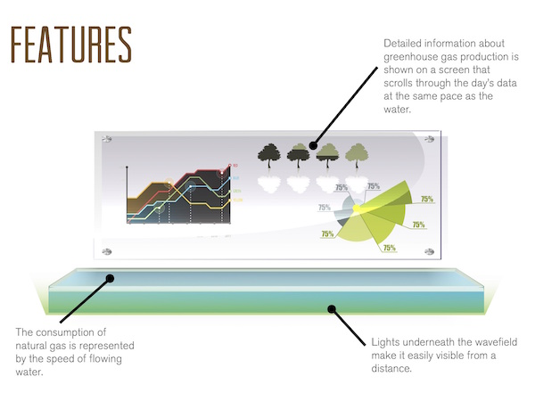
        

        

            
Combining a display panel and water installation to show energy use physically. Interesting in theory, hard to prototype well with the amount of time we had.
 
        

        

    

    
    

        

            <h3>They like it, but…</h3>
            
Our refined designs were presented to the city engineers responsible for the energy consumption project. I put together some handouts, and my teammates designed the slides with 3d renders for them. While there was a lot of enthusiasm for what we had come up with, the engineers raised some serious concerns about them. The wavefields were complex, and somewhat difficult to understand; which part represented what? How fast would the water move? Wouldn’t it get messy, especially if people are playing with the water? Then they worried that the cloud pillows could be stolen, and would be extremely unhygienic if many people hugged them.

            
Our professor suggested that we take the wavefield design, then simplify and clarify it. But neither I nor my team could think of a good way to do so. Take out the water and there’s not much left in the design. After some major frustration and a lot of futile whiteboard sketches, I felt like we were in serious danger of getting stuck. I analyzed what were the strengths of our previous two designs:

            <ul>
                <li>Using physical properties (water, light) as metaphors</li>
                <li>Displaying changes in energy use with physical changes</li>
                <li>Integrating the designs within the buildings</li>
            </ul>
            
Then I did another round of sketching ideas that I thought would embody those strengths, and build on both of the designs my team had presented. Pretty quickly, I hit on air in bubbles or balloons as the leading design concept. My team happily went for the design, because using air to represent gas usage was intuitive like water but without the mess. I liked the idea of making the building breathe as if it were a living building. The balloons inflating and deflating would represent its lungs, and less energy consumption would mean healthier air for it.

        

        

    

    
    

        

            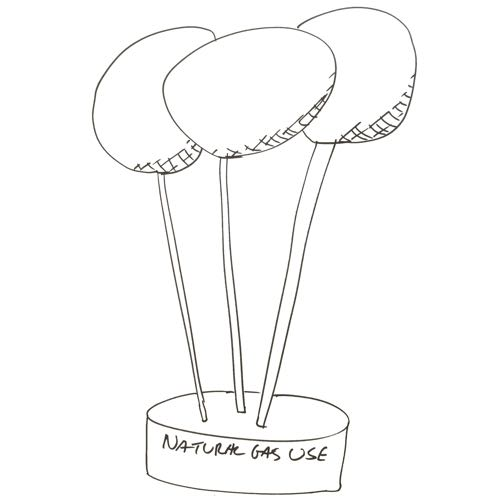
            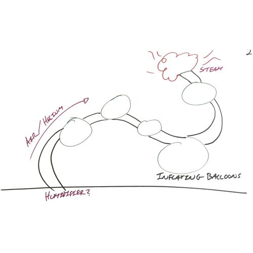
            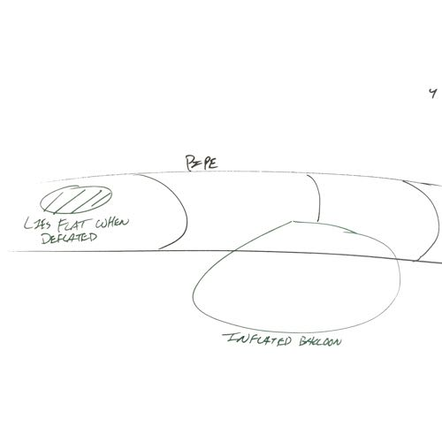
            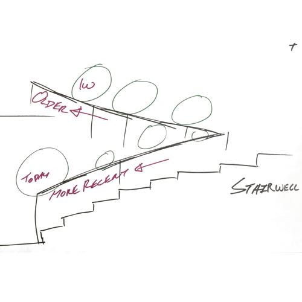
            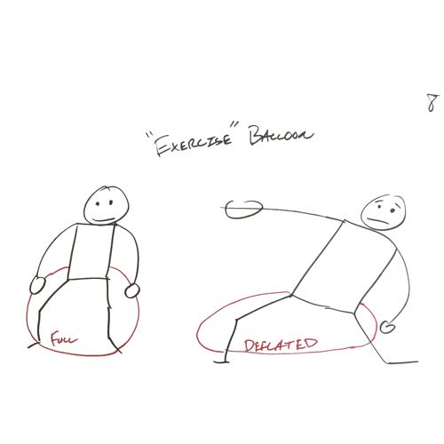
            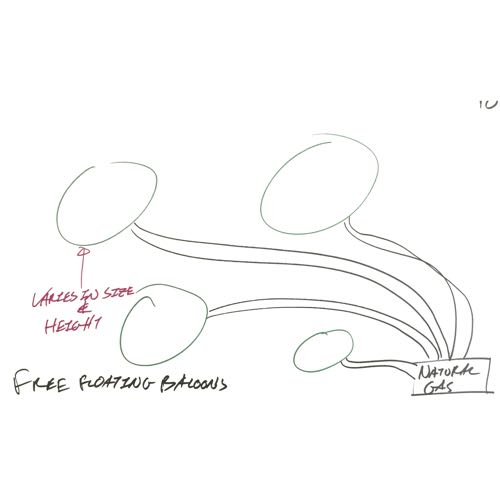
        

    

    
    

        

            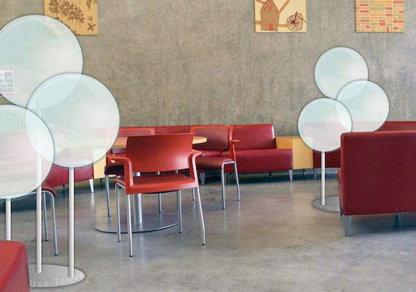
        

        

            
The baloons in action at Sunset Community Centre.
 
        

        

    

    
    

        

            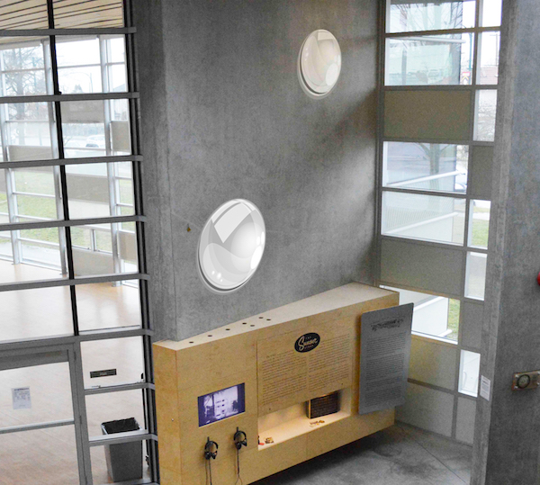
        

        

            
Mounting baloons on the walls.
 
        

        

    

    
    

        

            <h3>Wait, we’re going to build this thing?</h3>
            
In preparation for the next round of presentations, I started building a small-scale physical prototype. I was able to use data from the city building API, and worked on ways of getting that to control a motor using an Arduino board.

            
Our next presentation went pretty well, especially considering that the class was shocked we had dropped both of our refined designs from before. Most of the feedback we got was about the material of the balloon, and how exactly the size of the balloon could be understood by viewers.

            
However, my prototyping had uncovered a major catch in using balloons: getting the amount of air pressure necessary for inflating a balloon would be difficult, and whether we could control it with an Arduino was totally unknown. With the amount of time left in the course, it was too big of a risk to be spending all of our time trying to figure it out. Instead, we made one final refinement, from balloons to sails. The same principle, but now we just needed to control fans.

        

        

    

    
    

        

            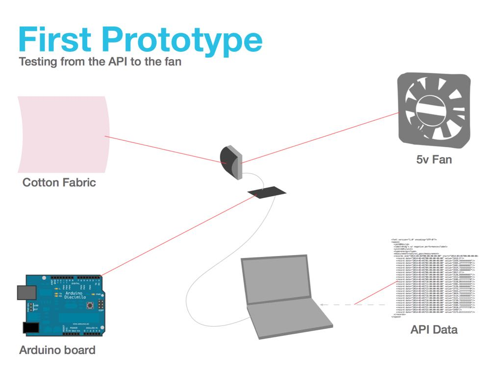
        

        

            
A slide from my presentation on how the prototype would be assembled.
 
        

        

    

            
    

        

            
I connected a series of small fans to my Arduino board, which allowed me to test different blowing patterns. It was clear from the start that just on and off wouldn’t work. We would have to pick a point at which the energy consumption was too much, then turn the fans on. That would also mean the fans would be off for most of the day. Not much point that. Going back to my idea of treating the balloons as lungs for the building, I tested different rates at which the fans would go on and off. When too much energy was being used, the the fans flipped on and off suddenly, as if they were hyperventilating. When less energy was being used, the fans ran for longer periods, like calm breathing.

        

        

    

    

    
    

        

            <h3>The final crunch</h3>
            
We presented this last idea before the city engineers, and they thought we had a solid concept. The breathing building went over especially well with them. Our plan was to build a scale prototype of the design, fully functional with live data from the city’s API. The target location for the prototype would be the Sunset Community Centre, the most attractive of the city buildings connected to the API, and a good match for the sails; the glass roof had fabric draped underneath it to diffuse light. Our sails design would integrate the cement walls with the roof.

            
Unfortunately, creating so many prototypes, being critiqued, and presenting to city staff took a serious toll on the team and myself. After so many weeks of iterating and throwing out designs, my team was burned out. As time dragged on, I found myself taking on a larger role in the project. For the final stage of the project, I ended up making almost the entire prototype myself, plus making the posters to go with it.
 
            
Thankfully, my teammates were able to research and select materials to use for the fabric. We selected silk for its appearance and strength in the full-size design, and used nylon in the prototype. The colour white was used as a default to communicate that they were sails and would behave like sails. The wood backing was selected to match the wood elsewhere in the Sunset Community Centre, and was intended to be visually minimal.

        

        

    

    
    

        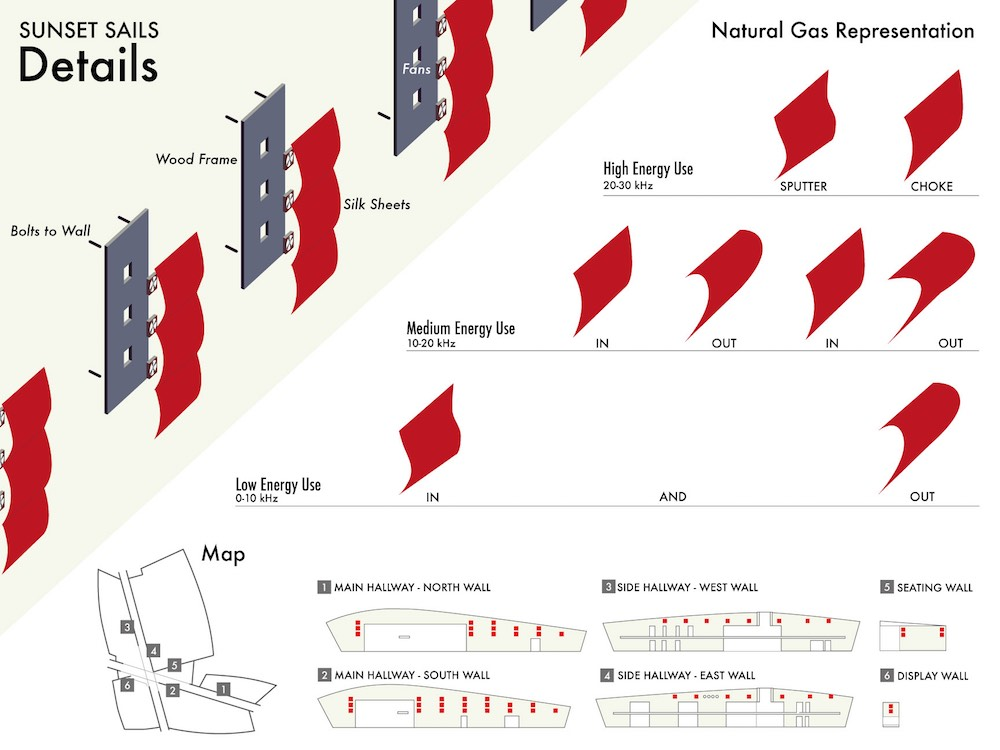
    

    
        

        

            <h3>Results</h3>
            
The result was much rougher than I would have hoped– “you’re still one more iteration away from getting it right” said my professor–yet I did manage to produce a fully functional scale prototype. The Arduino in the prototype connected to the city's green buildings, delivering live energy usage data that controlled motors in the prototype. And the posters were reasonably effective at explaining the design, even if their own design was sparse. The city probably wouldn’t ever take on such a project, yet after so much toil I was relieved and proud to have a solid proof of an innovative design.

        

        

    

    
    

        

            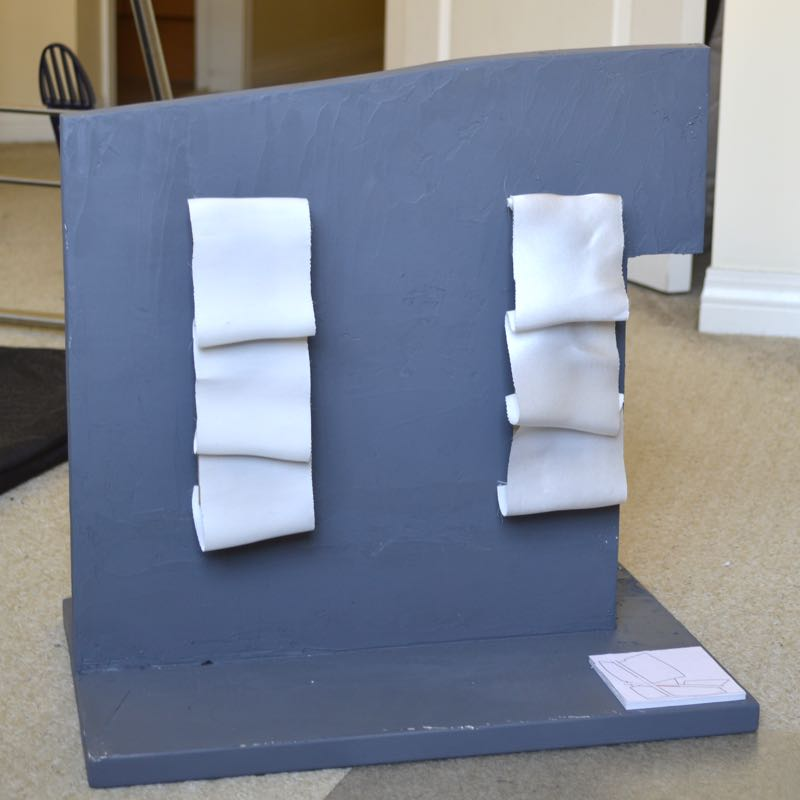
        

        

            
The physical prototype, showing a slice of Sunset Community Centre's walls with the sails attached.
 
        

        

    

    
    

        

            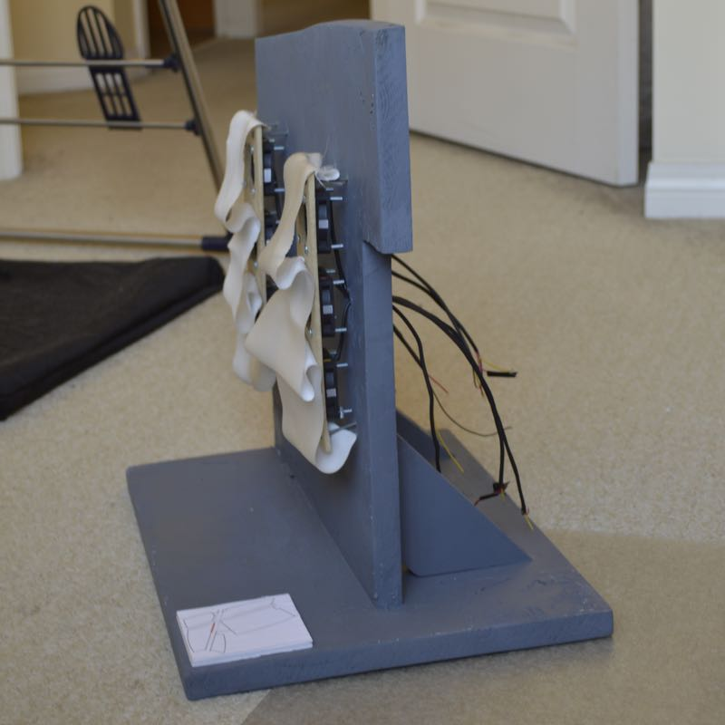
        

        

            
The physical prototype from the side, with the backing of the sails visible and the wires to the (not shown) Arduino board.
 
        

        

    

    
    

        
Tools used:

        <ul>
            <li>Processing (Java)</li>
            <li>XML</li>
            <li>Arduino</li>
            <li>Adobe Illustrator, InDesign, Photoshop</li>
        </ul>
        
Skills applied:

        <ul>
            <li>Physical prototyping</li>
            <li>Photography</li>
            <li>Data visualization</li>
            <li>Graphic design</li>
        </ul>
    

