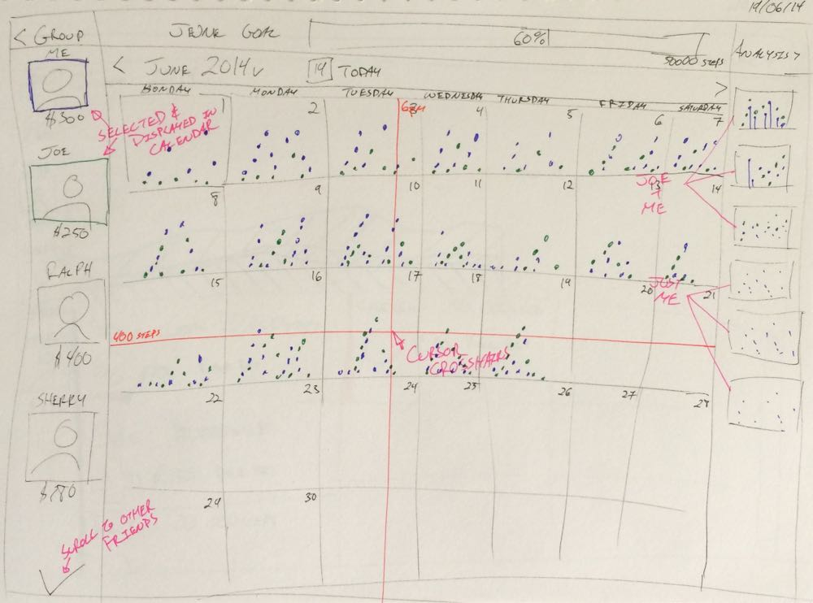
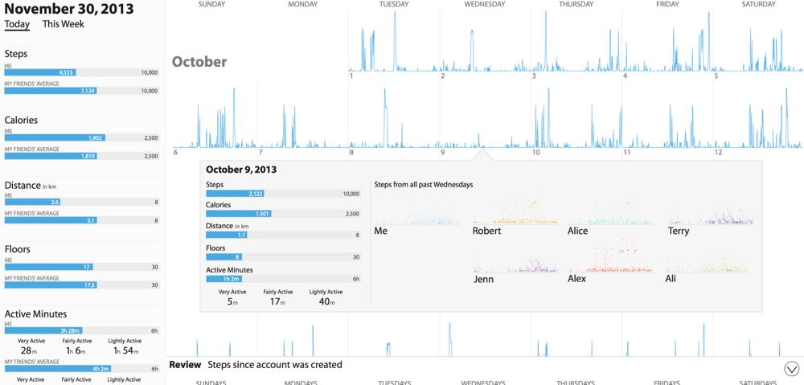
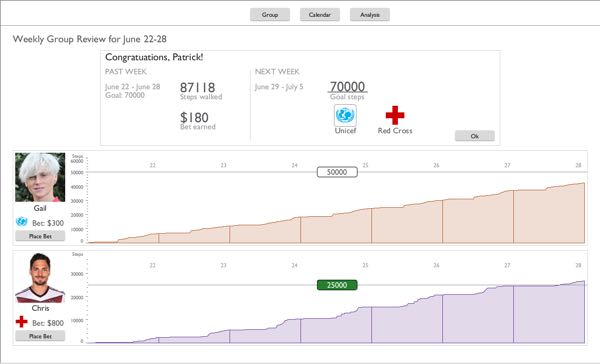

   

        <h3 id="supra">Fitbit for Arthritis</h3>
        

            
An interface that uses data from Fitbit devices to help people with arthritis achieve better health.

            
            
<a href="index.html">View the Arthritis for Fitbit final prototype</a>

        

        

            
Technologies used:

            <ul>
                <li>Axure</li>
                <li>Adobe Illustrator</li>
                <li>Processing (Java)</li>
                <li>JavaFX (Java)</li>
                <li>HTML/CSS</li>
                <li>XML</li>
                <li>JSON</li>
                <li>d3.js (JavaScript)</li>
                <li>pandas (Python)</li>
            </ul>
        

        

            

                
This was a lengthy project I worked on for my last two years in SIAT, which started as a directed studies course with Professor <a href="http://www.sfu.ca/~shaw/">Chris Shaw</a> and then grew into a research assistant position in his lab. The concept was straightforward: create data visualizations based on Fitbit data to encourage people with arthritis to get more exercise. These would be used by physiotherapists to monitor and assist their patients’ health.

            

            

        

        

            

                
            

            

                
A sketch showing one of the calendar layouts I came up with. Note the "crosshairs", which allowed different days in the month to be compared. One day's data could be dragged to the right panel to be saved for later or shared on social media.
 
            

            

        

        

            

                
My early work on this project was a mix of trying to figure out if the concept could work, and creating designs to go with it. I learned how to access the Fitbit API, using their OAuth 1.0a authentication, which allowed me to create some basic interactive prototypes in Processing. For designs I sketched many concepts that used calendars as “data cards” which could be shared on social media. These interfaces were mocked up in Axure.
 
            

        

        

            

                
            

            

                
A high-fidelity mockup of the calendar layout. Selecting a day brings up the panel in the centre, loosely inspired by iTunes' album display.
 
            

            

        

        

            

                
But when we presented these first concepts and prototypes to the group of physiotherapists we were partnered with, we discovered we hadn’t understood their needs. I was trying to encourage users get more exercise, but people with arthritis can't and shouldn't move too much. They need just the right amount of exercise to get their joints flexible without causing injury. This made visualizing the goal that much harder. Different users might need to get exercise at different times of the day for some limited amount.
 
            

        

        

            

                
            

            

                
One of the more amusing features I came up with was a system to allow users to bet on each others' success. If you achieve your fitness goal for that week, you collect the money, lose and it goes to a charity of your choice. It didn't go over well with the physiotherapists.
 
            

            

        

        

            

                
After many redesigns and prototypes, I needed a different approach. Instead of redesigning the visualizations, I tried redesigning the data. Up until this point, I had used the per-minute Fitbit steps calories data. I wrote an algorithm to chunk the data into bouts of continuous activity. This proved to be a huge breakthrough, opening up a watershed of useful designs that did exactly what the physiotherapists were looking for. With some refinements, and a switch to visualizing in d3.js, I had a design that could be implemented as a system.
 
            

            

        

        

            

                
            

            

                
The first visualization created after my breakthrough with chunking the data; the final one is at the top of this section.
 
            

            

        

    
