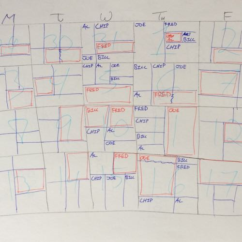
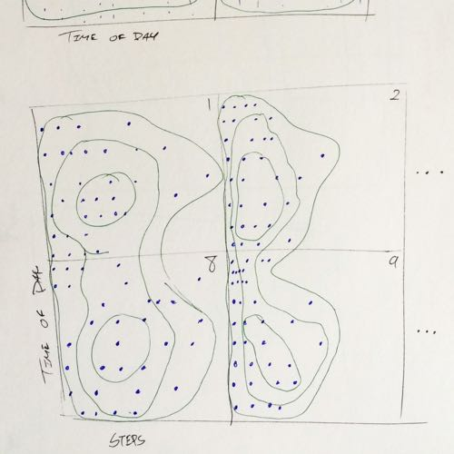
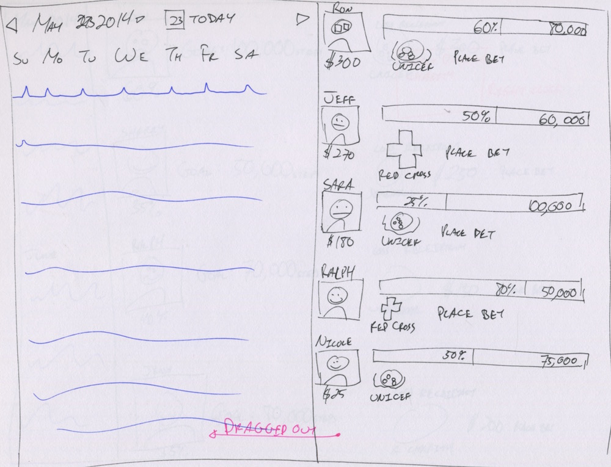
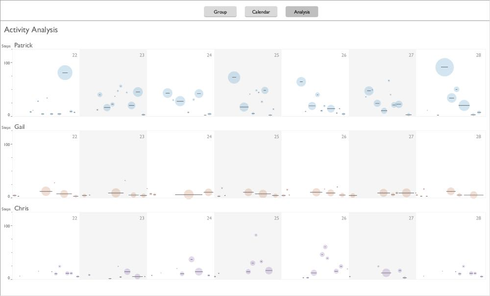

    

        
    

    

        

            <h3>Overview</h3>
            
Fitbit for Arthritis is my design for a web application featuring a data visualization that helps arthritis sufferers improve their health, and it allows health practitioners to support them. The data visualization steers users towards goals set by their health practitioner, helping them achieve an optimal amount of exercise to maintain their mobility and minimize pain. The application also includes some support for a social support group and logging, which are also shared with health practitioners.

            <h4>Role</h4>
            <ul>
                <li>Visual design</li>
                <li>Data analysis</li>
                <li>Development</li>
            </ul>
            <h4>Technologies Used</h4>
            <ul>
                <li>Axure</li>
                <li>Adobe Illustrator</li>
                <li>Java (Processing, JavaFX)</li>
                <li>HTML/CSS</li>
                <li>JavaScript (D3.js)</li>
                <li>Python (pandas)</li>
            </ul>
            
<a href="demo/index.html">View Fitbit for Arthritis demo</a>

        

    

    

        

            <h3>The open-ended spec</h3>
            
This was a project I worked on for my last two years in SIAT, which started as a directed studies course with Professor <a href="http://www.sfu.ca/~shaw/">Chris Shaw</a> and then grew into a research assistant position in his lab. The concept as presented was straightforward: create data visualizations based on Fitbit data to encourage people with arthritis to get more exercise. These would be used by physiotherapists to monitor and assist their patients’ health.

            
My first task was to determine what this project would become. I had a huge amount of room to work within, and a challenging goal. Fitbit already has a perfectly decent dashboard, and it’s already helped me get more exercise. What would a dashboard for arthritis sufferers look like, and what features would it have? My approach was to sketch like mad, and empty out of my head whatever ideas I could think up about an arthritis visualization.

        

        

    

    

        
        
        
        
        
        
        
        
        
        
        
        
    

    

        

            <h3>Digging in</h3>
            
Along with sketching, I also looked up what other health researchers were doing with Fitbit and other fitness trackers. There had been a small, but growing, trend of interest in using Fitbit devices over the past few years. Most of this research concentrated on whether Fitbit devices should be used in health care. Fitbits aren’t as accurate as some of the medical-grade fitness trackers, but they’re much cheaper and less bulky to wear. For most patients, they were good enough. Research in using Fitbits for motivation was still rare at the time.

            
After working through a number of iterations, the most interesting concepts found by my supervisor in my designs were calendars. They offered ways for users to compare their activity to previous days, which would be especially useful if they could log how they felt. For example, users could log when they felt sore, then track on what days they were sore with the application. Fitbit’s existing dashboard buried this information on a separate logging page, and we knew that logging pain or medications easily would be a major improvement for arthritis sufferers.

        

        

    

    

        
        
        
        
        
        
        
        
        
        
        
        
        
        
        
    

    

        

            
Of course I wasn’t just designing a calendar, I was designing an interactive data visualization calendar. Calendars already a social medium—we give our time to others—and I was exploring how to use them as a social medium for data visualization. The foundational unit of a calendar is the day, the square box representing one unit of time. In my sketches, I turned the static days into interactive cards. Each day could be treated like a card that users can manipulate or share with others.

        

        

    

    

        
    

    

        

            
During this time, I learned how to access the Fitbit API, which allowed me to create a few simple prototypes in Processing. I used these simple prototypes to test out my designs, and experiment with different forms of interaction. Around the lab I felt like Johnny Appleseed of the Fitbit API, helping others get access to the API for their own research projects by teaching them about RESTful APIs and OAuth.

        

        

    

    

        

            
            
            
        

    

    

        
    

    

        

            <h3>Seniors betting on their health. Yes, really.</h3>
            
It was at this time that we came up with one of the wackier ideas for the project, gambling. Concerned that we didn’t have enough of a motivation for users, my supervisor suggested a monetary incentive. With my economics background, it didn’t take long for me to think up with a gambling system.

        

    

    

        

            
        

        

            
Betting without money: "hostage" goods, given away if goals aren't met. Too complicated.
 
        

        

    

    

        

            
Users could bet on each other’s success at hitting a specified number of steps per day. If they are successful, they collect the money. But to make the gambling friendly, a loss does not go to the other users–we don’t want them discouraging each other! Instead, users pick a charity of their choice, with the money lost going to that charity. That way the incentives create win-win situation: even if a user misses their goal, the money goes to a cause they support. That is, unless they pick a charity they don’t support for extra motivation…
 
        

        

    

    

        

            
            
            
        

    

    

        
    

    

        

            <h3>Plentiful prototypes</h3>
            
Feeling confident with what I was doing, my supervisor decided it was time we presented my work to the group of physiotherapists we were collaborating with. I created some higher fidelity designs in Illustrator, focusing on building the layout over any particular aesthetic. They were essentially slightly more attractive wireframes. The typeface, Myriad, and the colour scheme were chosen to evoke a friendly, low-key appearance. The focus, and most of the colours, was on the data.

        

        

    

    

        

            
        

        

            
A high-fidelity mockup of the calendar layout. Selecting a day brings up the panel in the centre, loosely inspired by iTunes' album display.

        

        

    

    

        

            
        

        

            
The group page of the Illustrator mockup, featuring the gambling area and friends list.
 
        

        

    

    

        

            
        

        

            
The analysis page, showing past trends overlaid onto weeks of data.
 
        

        

    

    

        

            
The physiotherapists were pleased with the Illustrator designs, especially when they proved to be useful obtaining grant money. While it was nice that they liked the designs, I felt uncomfortable going for so long without in-depth feedback from anyone other than my supervisor. I took the Illustrator designs and used them as a base to create an interactive prototype in Axure. Then using the exported Axure webpage, I inserted one of the simple Processing sketches I had made to fully mock up the design. This came very close to being a fully functional interactive prototype, which gave me a good sense of how all the pieces could fit together.

        

        

    

    

        
    

    

        

            
The Axure prototype didn’t see much use, unfortunately, because my supervisor felt that we needed to have the visualizations up and running soon, so my attention turned to them. I began work on a Processing prototype with all of the features present in the Illustrator mockups and Axure prototype, but actually working. At the time, I wasn’t familiar with other data visualization tools, so it seemed like Processing would be the best and fastest choice for building a fully functional prototype. The aesthetic of this prototype remained similar to the Illustrator and Axure prototypes because I was still concentrating on the layout and data visualization design.

            
My Processing prototype represented a major advance in the design. The calendar could be navigated, and days could be selected to view in detail. As well, days could be dragged onto the sidebar for comparison, fulfilling the cards metaphor. And the gambling screen was shown in all its competitive glory. My personal favourite touch was the “crosshairs”, the vertical and horizontal lines that followed the mouse that let users compare multiple days simultaneously. The crosshairs made it possible to compare the same time of day across weeks, or the same level of activity across a week.

        

        

    

    

        

            
        

        

            
The calendar screen with data from two users shown, selected on the left sidebar. Saved days are located on the right sidebar.
 
        

        

    

    

        
    

    

        
    

    

        

            
Since I wasn’t able to get as much feedback as I liked from the physiotherapists, and I didn’t have the time to find seniors with arthritis for user testing, I went to the next best thing: my mom. Conveniently (for me, not her) she suffers from arthritis in the hip, making her a perfect candidate for collecting data and testing with.
 
            
In the research I had done earlier, I read that Fitbit had difficulty tracking irregular steps. I picked up the pandas library for Python, and started playing around with my mom’s data. I noticed that there did seem to be more gaps of inactivity in my mom’s data, which made it difficult to draw as a time plot. The gaps were so small that the pixels blobbed together on screen. I tried to chunk together the data into blocks of activity. This was interesting enough that I made it into an experimental visualization. The blocks of activity were visualized as circles, and I modified the gambling goals into lines for the circles to match in size.

        

    

    

        

            
        

        

            
Each circle represents a block activity, with some tolerance for inactivity (e.g. 5 minutes) before the block ends. The line is the average number of steps during the block, and the circle the total number of steps.
 
        

        

    

    

        

            <h3>The value of criticism</h3>
            
When we presented this interactive prototype to the physiotherapists, my concerns about getting enough feedback were proven correct. We discovered that we hadn’t done nearly enough to understand their needs or even just get some basic requirements. I was trying to encourage users get more exercise, but I was warned this was actually dangerous: people with arthritis can't and shouldn't move too much. They need just the right amount of exercise to get their joints flexible without causing injury. This made visualizing the goal that much harder. Different users might need to get exercise at different times of the day for some limited amount.

            
Gambling shot down by the physiotherapist group as well, because aside from being vaguely offensive it would encourage too much exercise. It also hit me just how far off we were from understanding our users. For example, I and pretty much everyone I knew thought that the flower visualization was totally useless. On Fitbit devices, there’s a flower whose height is determined by how close you are to hitting your goals. But I can’t even tell what goal it’s based on, and it’s difficult to tell exactly where I am. We discovered that among the seniors that the physiotherapists worked with, they all loved the flower, far more than reading the exact data points. This was a total shock to me: even my mom didn’t like the flower!

        

        

    

        

        

            
        

        

            
The flower visualization on the Fitbit One. I think this is what it looks like when you've hit your daily goal, but there may still be more room at the "top".

        

        

    

    

        

            
Surprisingly, the one thing I made that did go over well was the experimental visualization. When the physiotherapists saw this, they exclaimed in unison “that’s it!” It turned out that showing activity in chunks was not only what they had wanted, but that there was even a formal definition for what constituted a bout of activity for physiotherapy. The entire discussion at the meeting pivoted to how we could make this visualization work, as it had gone from being a cute experiment to vital for the project’s success. It was like I had somehow read their minds.

            
This was a very hard lesson in how important critiques are. Most of my Processing prototype—that I had spent weeks on—turned out to be useless. There was literally no point pulling it forwards because we needed a website, not a Java application. If I had this feedback much earlier in the design process, I would have been able to hone in on the right design far sooner. But the silver lining was that I had also discovered the value of experimentation. By essentially redesigning the data, I was able to produce a totally original data visualization. The lesson here is that design has to extend much farther beyond than just visuals and interfaces to be successful.
 
        

        

    

    

        

            <h3>On a track</h3>
            
Now knowing that I had finally found the right design, I had to get the design right. The circles in my original design looked attractive, but were essentially redundant. The size of the circle and its vertical location were basically the same data, the total steps and average steps for the bout period. Yet after having thrown out so many ideas, there wasn’t an obvious path to take. The worst part was that I had to throw out most of my Processing prototype, which made me leery of going back to code until I was sure that I had a design I felt confident in.

            
But due to the challenges of working with professionals who were otherwise busy, I wasn’t able to get more feedback from the physiotherapists group. As ever, my approach in this situation was to go back to paper and get some fresh ideas. Feeling inspired by the flower, I tried more cartoon figures, using trees and plants to symbolize progress. But I didn’t feel like these were especially easy to read or logical, and I seemed to be just repeating the problems I found in the flower.

        

        

    

    

        

            
            
            
            
            
            
        

    

    

        

            
In a bit of serendipity, I went to the library to do some research, where I found a book on health care architecture. The simple, lively colours used there inspired me to experiment with much more minimalist forms. And yet, they almost perfectly achieved what the physiotherapists were looking for. I communicated activity and inactivity with just two colours, and whether that was good or bad with solid or stripes. My favourite touch was the use of “shadows” from the bars to indicate cool down times when users should take a break from exercise. When my supervisor and the physiotherapists saw them, they were very pleased with the designs.

        

        

    

    

        
        
        
    

    

        

            <h3>Results</h3>
            
The final step was to build the web application that the physiotherapists were looking for. I was only involved in the beginning of this by implementing my design in d3.js. That much was used as a basis for a simple test by the physiotherapist group with users. They were able to log in with their data, and found it to work well. Another one of the researchers in the lab took over the project at that point, and he is still working the other aspects of the website to completion.

        

        

    

    

        
    

