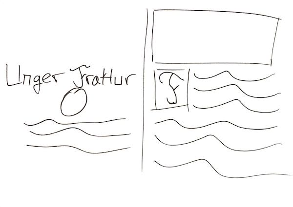
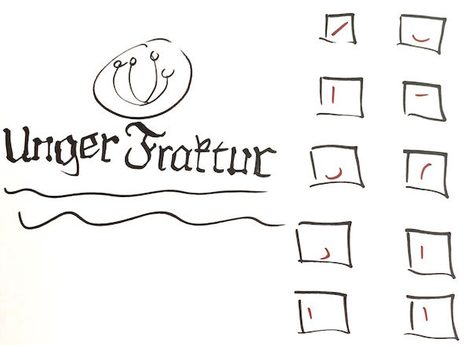

    

        
    

    

        

            <h3>Overview</h3>
            
An individual course project to design a poster analyzing and presenting the features of a unique typeface

            <h4>Role</h4>
            <ul>
                <li>Visual design</li>
            </ul>
            <h4>Technologies Used</h4>
            <ul>
                <li>Affinity Designer</li>
            </ul>
        

    

    

        

            
In fall 2015, I took a course in typography at Emily Carr University of Art + Design. Aside from a general interest as a designer, I realized that typefaces (or fonts, if you must) are especially important for the web. As vector objects they scale well, which is a useful feature when creating responsive designs.

        

        

    

    

        

            
        

        

            
One of the various sketches I made for the Unger Fraktur poster.
 
        

        

    

    

        

            
The goal of this poster was to showcase a typeface. I was interested in blackletter type because I had rarely used it, and I thought it would prove to be an interesting challenge to research. That led me to discovering Unger Fraktur, a somewhat forgotten but attractive variant of the Fraktur blackletter family.

        

        

    

    

        

            
        

        

            
A later sketch, showing how the features of Unger Fraktur's predecessors could be compared.
 
        

        

    

    
    

        

            
My approach to the poster was to inform designers about what made Unger Fraktur unique, hopefully encouraging them to use it (and use it properly). I highlighted the predecessors of Unger Fraktur, older fraktur blackletters and Didot. In particular, I examined the components of the glyphs, showing how they borrowed and combined parts from such wildly different typefaces.

        

        

    

