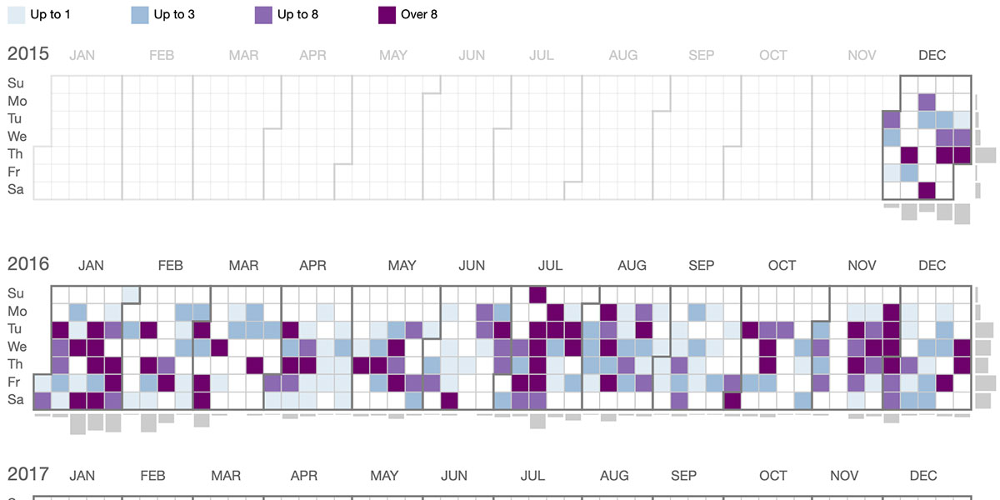
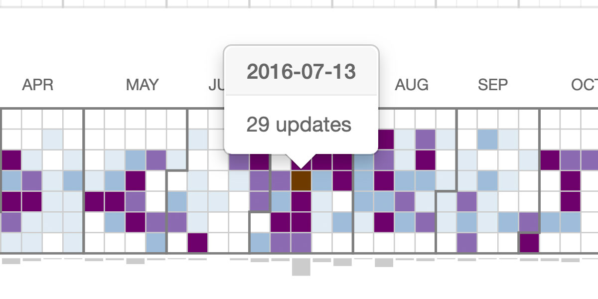
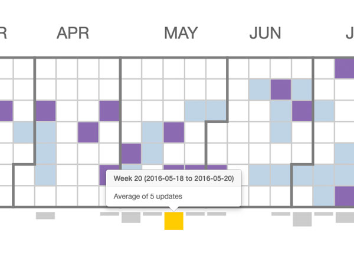
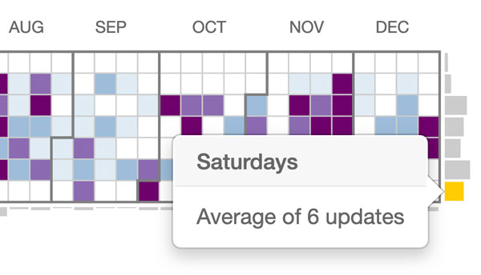
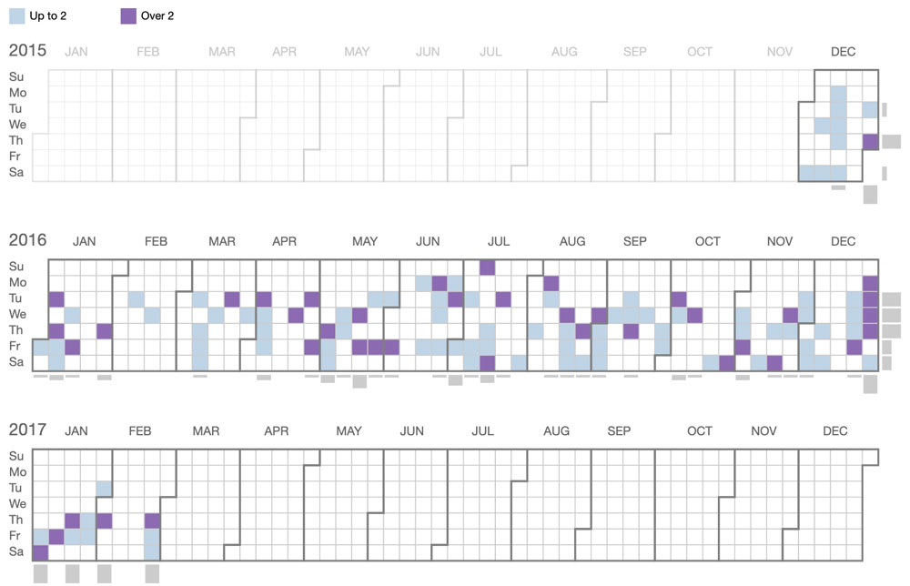

    

        
    

    

        

            <h3>Overview</h3>
            
While at Biopolicy Innovations Inc. (BPI), I built a heat map calendar visualization React component for the <a href="https://www.policyreporter.com">Policy Reporter</a> website. This component summarized millions of updates into one summary calendar, helping users learn about when and how often American health insurance policies change.

            <h4>Role</h4>
            <ul>
                <li>Visualization design</li>
                <li>Data analysis</li>
                <li>Front-end development</li>
            </ul>
            <h4>Technologies Used</h4>
            <ul>
                <li>Adobe Illustrator</li>
                <li>SASS</li>
                <li>PHP</li>
                <li>PostgreSQL</li>
                <li>JavaScript (React, Redux, D3.js)</li>
            </ul>
        

    

    

        

            <h3>Policy updates</h3>
            
BPI provides data about American health care insurance plans on the Policy Reporter website. These plans are constantly changing policies for how procedures and drugs are covered. When a policy is changed, the insurance payer will publish an update describing the changes. For most consumers, let alone researchers, it can be difficult to follow these updates. Policy Reporter presented a list of all updates from all payers and plans, with annotations to indicate what changes were most relevant.

            
The updates page listed millions of updates, spanning thousands of plans across many years. At one point, it was possible to crash the page if too large of a search was run. To help users see the bigger picture on policy updates without breaking the page, I was brought in to design a visualization that would summarize the data.

            
I didn’t have access to clients, but I was able to gather information from the team responsible for gathering updates. We went through a design process where I would present sketches and functional prototypes using D3.js to learn what type of visualization would best suit the data and users’ needs.

            
I settled upon the heat map calendar design, as it became clear that displaying trends was an important feature and there was enough data in the database to support it. For example, the heat map would make it easy to see clusters of updates (January being very common) or patterns of updates (such as a payer that released updates on Thursdays).

        

        

    

    

        

            
        

        

            
The more updates in a day, the darker the colour.

        

        

    

    

        

            
        

        

            
Total updates for each week were displayed with a bar below that week's column.

        

        

    

    

        

            
        

        

            
Total updates for a day (Mondays, Tuesdays, etc) were displayed with a bar on the right of that day's row.

        

        

    

    

        

            
No React visualization library at the time featured such a visualization, so I wrote it myself. The visualization was built as a React component, using data sent to it from a PHP backend via Redux and Axios. My biggest challenge was making sure that the visualization could correctly handle large and small ranges of data. I made sure that the colours and shapes could adjust correctly for whatever data was passed in, and wrote automated tests to handle all manner of unusual inputs.

        

        

    

    

        

            
        

        

            
Users can select search filters such as by plan, state, and payer, which will cause the heat map calendar to display only updates matching those criteria.

        

        

    

